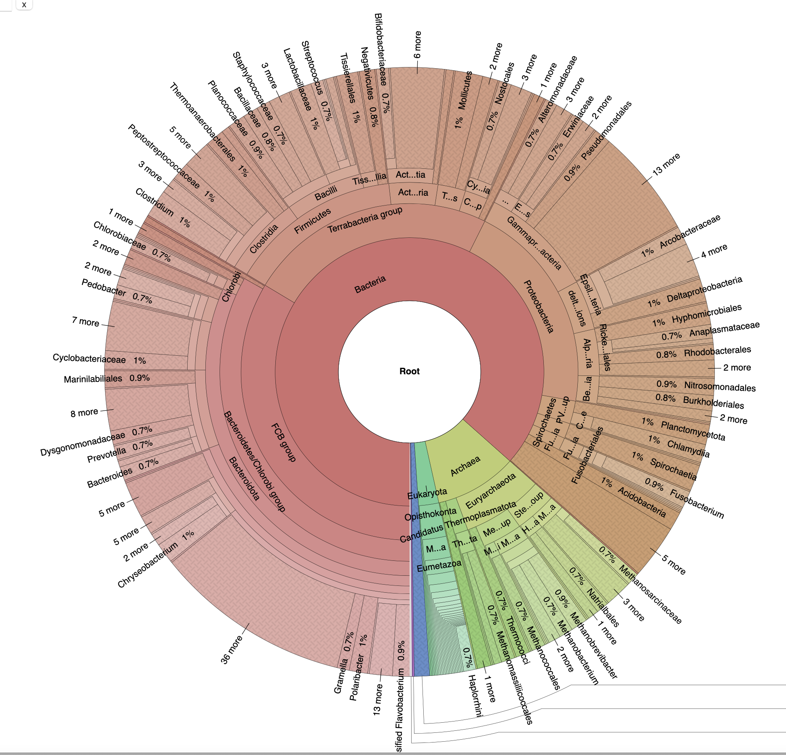

# Introduction to assembly-based metagenomics analysis.

The aim of this tutorial is to provide an introduction to the basic steps in an assembly based metagenomics analysis. We will perform taxonomic annotation of reads, perform a coassembly, generate MAGs and place them in a phylogenetic tree, using the command line. 

The workflow is quite typical and will involve:

1. [Taxonomic profiling](#profiling)

2. [Coassembly](#coassembly)

3. [Read mapping](#readmapping)

4. [Contig binning](#binning)

5. [Bin quality ](#checkm)

6. [Phylogenetic tree placement](#gtedb)
 


This will involve a collection of different software programs:

1. [kraken2](https://github.com/DerrickWood/kraken2): A kmer based read profiler 

2. [megahit](https://github.com/voutcn/megahit): A highly efficient metagenomics assembler currently our default for most studies

3. [bwa](http://bio-bwa.sourceforge.net/bwa.shtml): Necessary for mapping reads onto contigs

4. [samtools](http://www.htslib.org/download/): Utilities for processing mapped files

5. [Metabat2](https://github.com/BinPro/CONCOCT): an automatic binning algorithm
6. [checkm](https://ecogenomics.github.io/CheckM/#:~:text=CheckM%20provides%20a%20set%20of,copy%20within%20a%20phylogenetic%20lineage.): Tools to assess bin quality
7. [gtdb-tk](https://github.com/Ecogenomics/GTDBTk): Toolkit to place MAG on reference phylogenetic tree and use placement for taxonomy classification. 


<a name="coassembly"/>

## Getting started (VM, ssh & env)


Please ssh to your vm using the -Y option so that X forwarding can be done. 

    ssh -Y ubuntu@xxx.xxx.xxx.xxx 


We use a [conda](https://docs.conda.io/projects/conda/en/4.6.0/_downloads/52a95608c49671267e40c689e0bc00ca/conda-cheatsheet.pdf) env to install all dependencies, you don't need to install anything and all dependencies are available but only inside that environment.   

Try to check the command line help of megahit

    megahit -h
<details><summary>not working?</summary>
<p>
Conda environment are created as independant environment to everything else, you need to "activate" an environment to be able to access the sets of tools installed inside.

    conda env list
    conda activate Intro
    megahit -h

</p>
</details>


## Getting data
Let's create a Projects directory and work inside:

    mkdir -p ~/Projects/AD_binning
    
Anaerobic digester metagenomic time series subsampled for this tutorial, reads mapping only to a few bins of interest.
Please download and extract the dataset using this link: 
```bash
cd ~/Data
wget http://seb.s3.climb.ac.uk/strain_practial_data.tar.gz
tar -xvf strain_practial_data.tar.gz
```

## Taxonomic profiling with Kraken2

Our first task it to profile one of the samples with Kraken2. The Kraken2 database is here ~/Databases/MiniKraken. Can you figure out how to run sample1 forward reads through Kraken2 and generate a report using 8 threads - '--use-names' is also a useful flag?
Do this in a new directory Kraken.

<details><summary>~~Hint~~</summary>
<p>

 If you don't know how to use Kraken2, type it in the terminal, it will show you which argument are needed. If you can't make sense of what's written, have a look on the internet for the full documentation.

 </p>
</details>

<details><summary>spoiler</summary>
<p>

 ```bash
cd ~/Projects/AD_binning
mkdir Kraken
cd Kraken
kraken2 --db ~/repos/MiniKraken ~/Data/AD_small/sample1/sample1_R1.fastq --threads 8 --use-names --report kraken_report.txt --output kraken_sample1
```

 </p>
</details>
How many reads have been classified? Why did this happen?
If Kraken2 was able to classify all reads. What sort of information does it gives us. Is it the diversity, the accurate number of each organisms?

We can visualise the kraken report as a Krona plot. Before doing that will need to run this step just once (on Birmingham VMs only):
```
    cd ~/repos/miniconda3/envs/Intro/opt/krona
    ./updateTaxonomy.sh
    cd ~/Projects/AD_binning/Kraken
```


:

```bash
ktImportTaxonomy -q 1 -t 5 kraken_report.txt -o kraken_krona_report.html
```

This html output will have to be downloaded onto your own computer if you want to open it using a browser:

```bash
scp ubuntu@xxx.yyy.zzz.vvv:~/Projects/AD_binning/Kraken/kraken_krona_report.html .
```

 

## Assembly


We are going to use megahit for assembly. It is a fast memory efficient metagenomic assembler and particularly useful for handling large coassembly or large datasets.

Why would you want to do an assembly or a coassembly? 

Megahit is installed, reads are at 

    ~/Data/AD_small

Bioinformatics is mostly about reading documentation, and looking on the internet how to do things. 
Use the -h flag on megahit and try to craft a command line to launch the assembly.

<details><summary>spoiler</summary>
<p>

```bash
cd ~/Projects/AD_binning
ls ~/Data/AD_small/*/*R1.fastq | tr "\n" "," | sed 's/,$//' > R1.csv
ls ~/Data/AD_small/*/*R2.fastq | tr "\n" "," | sed 's/,$//' > R2.csv
megahit -1 $(<R1.csv) -2 $(<R2.csv) -t 8 -o Assembly --k-step 24
```
It should take about 10 mins
</p>
</details>

What is the output of an assembler?
How good is the assembly?
How would we estimate the number of organisms in the assembly?

## The return of the Kraken
We now have an assembly with contigs being quite larger than the initial reads. Let's try to use kraken2 for taxonomic classification.
Please take some time to modify previous command line to launch Kraken2 on the assembly.

<details><summary>spoiler</summary>
<p>

 ```bash
echo "Comme on I believe in you, you can change ~/Data/AD_small/sample1/sample1_R1.fastq by the correct path to the assembly (final.contigs.fa)"
```

<details><summary>spoiler</summary>
<p>

 ```bash
echo "also be sure to change name of the report and name of the output, otherwise you're going to erase previous results"
```

<details><summary>spoiler</summary>
<p>

 ```bash
cd ~/Projects/AD_binning/Kraken
kraken2 --db ~/Databases/MiniKraken ~/Projects/AD_binning/Assembly/final.contigs.fa --threads 8 --use-names --report kraken_assembly_report.txt --output kraken_assembly
ktImportTaxonomy -q 1 -t 5 kraken_assembly_report.txt -o kraken_krona_assembly_report.html
```

 </p>
</details>


 </p>
</details>


 </p>
</details>

How many contigs have been classified? Why did this happen?
 

<a name="readmapping"/>

## Read mapping

What kind of information can be used to bins contigs?

We use bwa mem to map reads to the assembly.
As preliminary step we need to index the assembly

```bash
cd ~/Projects/AD_binning/Assembly
bwa index final.contigs.fa
cd ..
```

Then I want you to try mapping the reads from the first sample contigs using 'bwa mem' inside a subdirectory Map to 
produce a sam file 'Map/sample1.sam':

<details><summary>the correct command is:</summary>
<p>

```bash
mkdir Map
bwa mem -t 4 Assembly/final.contigs.fa ~/Data/AD_small/sample1/sample1_R1.fastq ~/Data/AD_small/sample1/sample1_R2.fastq > Map/sample1.sam
```
</p>
</details>

You can look at the sam:
```
tail Map/sample1.sam
```

It is quite a complex [format](https://en.wikipedia.org/wiki/SAM_(file_format))

The sam file is a bit bulky so we never store alignments in this format instead we would convert it into its binary version: bam. Can you convert this file using the command 

    samtools view


<details><summary> Convert sam to bam command</summary>
<p>

```bash
    cd Map
    samtools view -h -b -S sample1.sam > sample1.bam
```
</p>
</details>

Using samtool we can filter only those reads which are mapped to the assembly.
```bash
    samtools view -b -F 4 sample1.bam > sample1.mapped.bam
```

For downstream analysis we needs the bam file to be sorted:
```
samtools sort sample1.mapped.bam -o sample1.mapped.sorted.bam 
```

To run all samples we would place these steps in a shell script:

```bash
cd ~/Projects/AD_binning
rm ~/Projects/AD_binning/Map/*

for file in ~/Data/AD_small/*/*R1.fastq
do 
   
   stub=${file%_R1.fastq}
   name=${stub##*/}
   
   echo $name

   file2=${stub}_R2.fastq

   bwa mem -t 4 Assembly/final.contigs.fa $file $file2 | samtools view -b -F 4 - | samtools sort - > Map/$name.mapped.sorted.bam
done
```

The for loop must be pasted as one chunk of text into the terminal or create a small shell script to store commands.
Can you make sense of what that script does? 

<a name="binning"/>

## Contig binning

The first step is to derive coverage from bam files. For this we can use metabat2 script. It takes bam files as input and produce a table of mean coverage depth and corresponding std for each contigs in each sample.

```bash
cd ~/Projects/AD_binning/Map
jgi_summarize_bam_contig_depths --outputDepth depth.txt *.bam
```

Make a new subfolder Binning. Move the Coverage file into this and look into crafting the metabat2 command line. Either use the help flag or a quick google search.

<details><summary> Solution</summary>
<p>

```bash
cd ~/Projects/AD_binning
mkdir Binning
mv Map/depth.txt Binning/depth.txt
metabat2 -i Assembly/final.contigs.fa -a Binning/depth.txt -t 4 -o Binning/Bins/Bin
```
</p>
</details>

How many contigs were clustered? 
```bash
cd ~/Projects/AD_binning/Binning/Bins
grep -c ">" *.fa | awk -F: '{ s+=$2 } END { print s }'
```
How many nucleotide were clustered?
```bash
grep -v ">" *.fa |wc -m
```
 
## Which bins are Metagenome assembled genomes (MAGs)?

A bin is a group of contigs put together from looking at coverage/composition. How do you assess bin quality?

Checkm is an handy automated pipeline which will use marker set specifics to bacteria/Archea to assess contamination/completion.
```bash
cd ~/Projects/AD_binning/Binning
checkm lineage_wf Bins/ checkm -x .fa
```

<details><summary>After launching checkm, are you having an issue?</summary>
<p>

Unfortunately the vm are a bit short on ram and pplacer, used by checkm to identify SCG taxonomy, is extremely ram greedy. 
Instead you will need to import output pre-generated for this tutorial. 

```bash
rm -r checkm
ln -s ~/repos/strain_resolution_practical/Intro_prerun/checkm.tsv .
```
</p>
</details>

What does each column mean? 

## A better idea of MAG identity

When doing metagenomic, it happens often that the MAGs you obtain are not in database, or just distantly related to references. Using single copy core genes we can place these MAGs in a phylogenetic tree full with known species representatives. 
The gtdb toolkit does that for you:

```bash
cd ~/Projects/AD_binning/Binning
gtdbtk classify_wf --cpus 4 --genome_dir Bins --out_dir gtdb --extension .fa --scratch_dir gtdb/scratch
```
That will take at least XXXX min. 

So instead lets have a look at the prerun results.
```bash
mkdir -p ~/Projects/AD_binning/Binning/checkm
cd ~/Projects/AD_binning/Binning/checkm
ln -s ~/repos/strain_resolution_practical/Intro_prerun/*.summary.tsv .
```
We obtain multiple files what are they?

Look at summary files what information can we obtain.

```bash
cut -f1,2,14,19 ~/Projects/AD_binning/Binning/checkm/*.summary.tsv
```

What is the RED, from gtdb?
